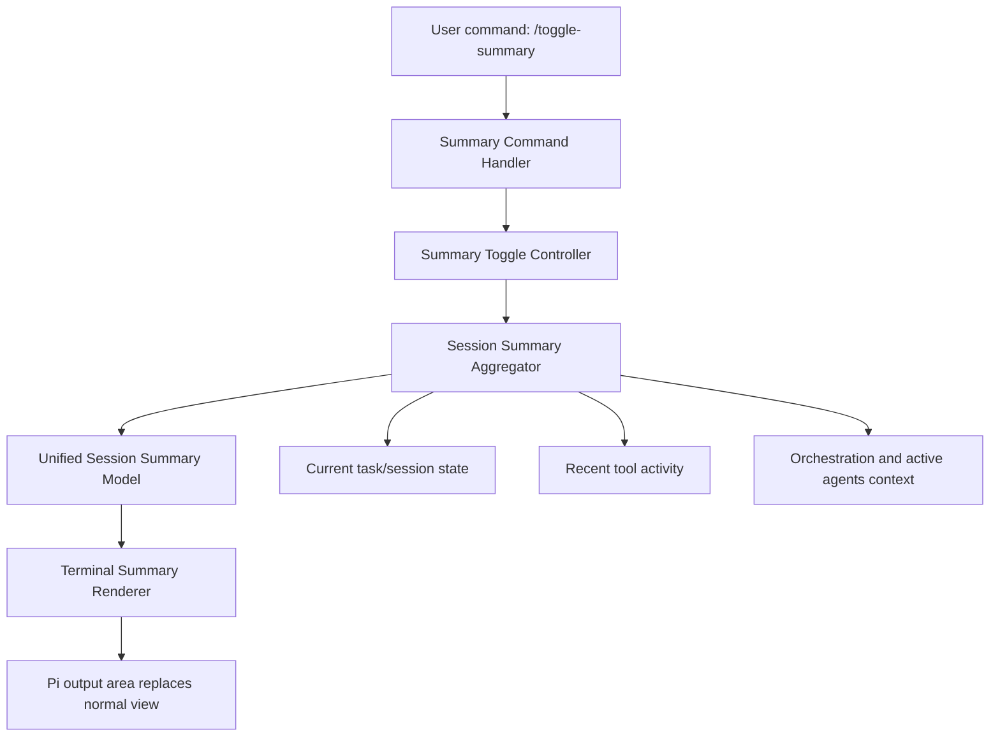

# Design Document

## Overview
This feature adds a terminal-first summary mode that swaps the normal output region for a single-page summary view of the main session’s work. The primary entrypoint is `/toggle-summary`, which toggles the work-summary view on and off for the current session. The design prioritizes reuse of existing terminal rendering patterns, task/session state, tool activity, and orchestration context already present in the codebase.

Out of scope:
- Building a browser-first viewer as the primary interaction model
- Redesigning the broader terminal layout or replacing existing viewer infrastructure
- Creating per-subagent or per-agent targeted summary pages in the first iteration
- Inventing detailed analytics/history dashboards beyond live work-summary needs

## Architecture
The feature introduces a summary-mode controller that tracks whether the work-summary mode is active and how summary data is aggregated from the current session. Existing session, task, tool, and orchestration state providers remain the source of truth; the summary layer adapts them into a unified session-summary model for rendering.



## Components and Interfaces

### 1. Summary command handler
Responsibilities:
- Register `/toggle-summary`
- Toggle the main session summary view with no per-agent targeting in the first iteration
- Delegate state transitions to the toggle controller

Possible reuse:
- Existing slash-command patterns in extensions
- Shared command conventions used for other terminal features

Suggested interface:
- `toggleSummary(): SummaryToggleResult`

### 2. Summary toggle controller
Responsibilities:
- Track whether summary mode is on or off
- Enter summary mode on first invocation
- Exit summary mode on second invocation
- Restore normal output mode when summary mode exits

Suggested state:
```ts
interface SummaryViewState {
  active: boolean;
}
```

### 3. Session summary aggregator
Responsibilities:
- Convert existing session-level state into a unified summary model
- Gather task status, elapsed time, tool activity, latest output summary, and optional active-agent context
- Reuse orchestration/subagent state only as supporting context within the main summary
- Provide placeholders when data is missing

Suggested interface:
```ts
interface SessionSummaryModel {
  title: string;
  status: string;
  task: string;
  elapsedSeconds?: number;
  toolCount?: number;
  latestOutput: string;
  recentTools: string[];
  activeAgents?: string[];
  isAvailable: boolean;
  availabilityMessage?: string;
}
```

### 4. Terminal summary renderer
Responsibilities:
- Render a single-page terminal layout inspired by the provided snapshot
- Present a stable header, key stats row(s), current task, recent tool activity, latest output, and optional active-agent context
- Preserve readability in narrow terminal widths
- Reuse existing style helpers and render conventions where available

Possible reuse:
- `extensions/lib/subagent-render.ts` for concise status/stat rendering ideas
- Existing widget registration/invalidation mechanisms where they can support summary redraws
- Existing theme helpers from extension UI utilities

### 5. Session-state integration adapters
Responsibilities:
- Task/session adapter: expose current task-at-hand fields from the active session context
- Tool-activity adapter: expose recent tool count and recent tool call summaries
- Orchestration adapter: expose active supporting agents when available
- Keep all adapters scoped to one unified session summary output

## Data Models

### Summary render payload
```ts
interface SummaryRenderPayload {
  headerTitle: string;
  headerSubtitle?: string;
  status: string;
  task: string;
  elapsedLabel: string;
  toolCountLabel: string;
  recentTools: string[];
  latestOutput: string;
  activeAgents?: string[];
  emptyState?: string;
}
```

## Error Handling
- Missing session summary fields: show placeholders such as `Unknown`, `0`, or `No recent output`
- Missing tool activity: show an unavailable or no-activity message without breaking the page
- Toggle collisions: if multiple summary commands arrive quickly, the controller should serialize state changes and preserve a valid on/off state
- Width constraints: if the terminal is too narrow, the renderer should degrade to a compact vertical layout instead of truncating core status completely

## Testing Strategy

### Unit tests
- Command behavior for `/toggle-summary`
- Toggle controller behavior for on/off transitions
- Session summary aggregation with full, partial, and unavailable session data
- Tool-activity summarization behavior
- Renderer snapshots for active, empty-state, and unavailable-state layouts

### Integration tests
- Verify slash commands register and invoke the summary controller correctly
- Verify summary mode swaps the output area and restores normal output on toggle-off
- Verify recent tool activity and optional active-agent context appear in the summary when available

### Manual validation
- Compare terminal layout against the provided snapshot reference
- Exercise toggling during active work with tool calls in progress
- Validate that subagent information, when shown, appears only as supporting context inside the main summary
- Validate behavior across theme changes and common terminal widths
