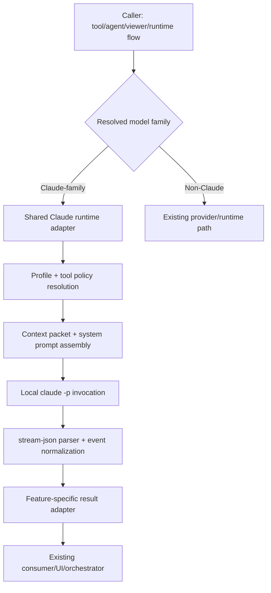
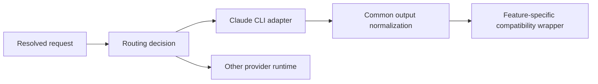

# Design Document

## Overview
This design standardizes Claude-family automated execution on the local Claude Code CLI runtime and removes dependence on direct Claude API/SDK automation within in-scope runtime paths. The `/advisor` execution model is the reference implementation: shared prompt/context assembly, profile-aware CLI argument building, stream-json parsing, normalized result extraction, and compatibility with existing orchestration/UI consumers.

The migration is driven by operational constraints: Claude automation must route through the local Claude Code CLI path, while the broader product must continue to support other model providers and existing flows. Therefore, the design changes Claude-family execution routing only, not the full provider architecture.

Explicit reuse priority:
- Reuse `extensions/lib/claude-cli.ts` as the primary Claude runtime transport.
- Reuse `extensions/lib/claude-advisor-runner.ts` patterns for context packet construction and normalized execution wrappers.
- Reuse existing model-resolution and Claude-family detection logic already covered by tests.
- Replace direct Claude SDK-based runtime call sites by adapting them to shared CLI-backed helper functions rather than embedding new one-off subprocess logic.

Out of scope:
- Replacing non-Claude providers with CLI-based execution.
- General provider abstraction redesign across the entire system.
- Introducing a brand-new session framework unless needed to preserve existing Claude multi-turn behavior.

## Architecture

### Current state summary
- `/advisor` already uses a local Claude Code CLI wrapper (`spawnClaudeCli`) and acts as the target pattern.
- Claude-family model resolution and profile logic already exist in the codebase and are partially tested.
- At least one non-advisor runtime flow (`extensions/cleanup-viewer.ts`) still uses direct `@anthropic-ai/claude-agent-sdk` automation and must be migrated.
- The codebase must continue supporting mixed-provider operation, so routing must remain selective rather than globally rewritten.

### Target architecture
Claude-family requests route through a shared Claude runtime adapter layer backed by the local `claude` CLI. Existing orchestrators, tools, viewers, and helpers invoke Claude work through that shared adapter instead of direct SDK calls.



### Migration layering
1. **Routing layer** decides whether a call is Claude-family.
2. **Claude runtime adapter** centralizes invocation setup.
3. **Feature adapter** maps generic CLI output/events into the specific consumer contract expected by each tool/flow.
4. **Existing non-Claude runtime** remains unchanged.



## Components and Interfaces

### 1. Claude family routing decision
**Responsibility:** Detect when a resolved execution request must use the Claude CLI path.

**Likely reuse points:**
- Existing Claude-family model detection logic referenced by tests such as `claude-overlay-routing` and toolkit/worker model resolution tests.
- Existing agent/model config under `agents/models.json`, `agents/toolkit-models.json`, and related runtime helpers.

**Design expectations:**
- Keep the current selection pipeline intact.
- Introduce or consolidate a single reusable predicate for “Claude-family runtime must use local CLI.”
- Ensure the predicate can be consumed by both agentic flows and utility-oriented runtime features.

**Constraints:**
- Must not alter non-Claude routing.
- Must remain compatible with current model identifier formats like `anthropic/claude-opus-4-6`.

### 2. Shared Claude runtime adapter
**Responsibility:** Provide a common programmatic interface for Claude CLI-backed execution.

**Existing code to reuse:**
- `extensions/lib/claude-cli.ts`
- `extensions/lib/claude-advisor-runner.ts`
- `extensions/lib/claude-tool-mapping.ts`
- `extensions/lib/claude-config.ts`

**Proposed interface shape:**
- A shared wrapper that accepts:
  - profile (`claude-worker`, `claude-advisor`, or equivalent future mapping)
  - task/prompt
  - cwd
  - model
  - tool policy
  - optional system prompt additions
  - optional context packet
  - optional session continuation inputs
  - callbacks for streamed text, status, tool events, stderr
- Returns a normalized result object with:
  - exit code
  - elapsed time
  - output transcript
  - final result text
  - optional session id

**Design expectations:**
- Avoid scattering raw `spawn("claude", ...)` calls across features.
- Keep CLI arg construction centralized to preserve consistency and testability.
- Support session continuation where the existing consumer needs continuity.
- Allow feature-specific wrappers to constrain tool permissions and prompt framing.

### 3. Feature compatibility wrappers
**Responsibility:** Preserve current contracts for each migrated Claude-backed feature.

**Example known target:**
- `extensions/cleanup-viewer.ts` currently streams direct SDK output to server-sent events and should be adapted to stream via the Claude CLI runtime while preserving viewer expectations.

**Wrapper behavior:**
- Translate shared CLI text/status callbacks into the feature’s expected stream/update format.
- Normalize final output into the current result payload shape used by the feature.
- Preserve existing UI timing and completion semantics where practical.

**Likely file targets:**
- `extensions/cleanup-viewer.ts`
- Additional runtime callers discovered during implementation inventory
- Possibly `extensions/lib/toolkit-cli.ts` and surrounding subagent runtime files if any Claude-family path still bypasses the shared Claude CLI helper

### 4. Migration inventory and coverage guard
**Responsibility:** Make in-scope Claude runtime call sites visible and keep tests aligned with the migration.

**Design expectations:**
- Create a migration inventory during implementation to enumerate direct Claude runtime call sites.
- Add targeted regression tests around migrated features.
- Prefer test patterns that verify shared helper usage or equivalent observable routing behavior instead of brittle implementation-only assertions.

**Constraint:**
- User selected “prefer CLI path with tests” rather than introducing a hard compile-time ban immediately, so enforcement should focus on migration plus coverage rather than an overreaching static blocker in this spec.

## Data Models

### ClaudeExecutionRequest
Represents a normalized request to run Claude via CLI.

```ts
interface ClaudeExecutionRequest {
  profile: "claude-worker" | "claude-advisor" | string;
  task: string;
  cwd?: string;
  model?: string;
  tools?: string;
  systemPrompt?: string;
  contextPacket?: string;
  sessionId?: string;
  resumeMostRecent?: boolean;
}
```

### ClaudeExecutionResult
Represents normalized CLI execution output.

```ts
interface ClaudeExecutionResult {
  exitCode: number;
  elapsed: number;
  output: string;
  result: string;
  sessionId?: string;
}
```

### FeatureAdapterContract
Represents the feature-facing mapping from generic CLI output to consumer-specific behavior.

```ts
interface FeatureAdapterContract<T> {
  onTextDelta?: (delta: string) => void;
  onStatus?: (status: string) => void;
  onToolStart?: (toolName: string) => void;
  onToolResult?: (toolName: string, status?: string) => void;
  finalize: (result: ClaudeExecutionResult) => T;
}
```

## Error Handling

### CLI invocation failure
- If `claude` cannot spawn or exits non-zero, surface a feature-compatible error message.
- Preserve stderr and normalized output for diagnostics.
- Avoid silent fallback to a direct Claude SDK/API path.

### Streaming/parse irregularities
- If stream-json lines are malformed or partial, preserve best-effort output assembly using existing normalization patterns.
- Feature wrappers should tolerate partial text callbacks and still resolve final output from the normalized result.

### Session continuity issues
- Where a migrated flow depends on continuity, support explicit `sessionId`/resume behavior through the shared adapter.
- If session continuation fails, return a clear failure path rather than silently starting an incompatible new conversation when that would change behavior.

### Mixed-provider flows
- If a shared flow resolves to a non-Claude provider, continue through the existing path.
- Failures in Claude CLI routing must not contaminate non-Claude runtime behavior.

## Testing Strategy

### Unit tests
Add or extend unit tests for:
- Claude-family routing decisions
- Shared CLI arg construction for migrated feature profiles
- Session continuation flag handling where used
- Feature adapter normalization from CLI stream events to consumer output
- Failure behavior when CLI spawn or result parsing fails

### Integration-style tests
Add focused tests around migrated runtime features, for example:
- `cleanup-viewer` analysis path uses shared Claude CLI helper semantics instead of direct SDK imports
- Streamed updates still reach the UI contract in the expected sequence
- Final payload shape remains unchanged for existing consumers

### Regression coverage
Validate that:
- `/advisor` behavior remains unchanged
- Existing Claude worker/advisor/subagent flows still route via CLI
- Non-Claude models and flows remain on their current runtimes

### Suggested verification commands
- Targeted test runs for Claude runtime modules and migrated features
- Search-based verification during implementation review for remaining in-scope direct Claude automation imports/usages
- Manual smoke checks for at least one migrated utility feature plus one existing agent/advisor path

## Implementation Hooks

### Likely files/modules
- `extensions/lib/claude-cli.ts`
- `extensions/lib/claude-advisor-runner.ts`
- `extensions/lib/claude-tool-mapping.ts`
- `extensions/lib/claude-config.ts`
- `extensions/lib/toolkit-cli.ts`
- `extensions/cleanup-viewer.ts`
- Routing/model-resolution helpers validated by:
  - `extensions/__tests__/claude-overlay-routing.test.ts`
  - `extensions/__tests__/toolkit-worker.test.ts`
  - `extensions/__tests__/subagent-model-resolution.test.ts`

### Dependency boundaries
- Claude-specific runtime changes should stay isolated from non-Claude providers.
- Shared orchestration/model-selection code may branch into Claude CLI routing but should not absorb provider-specific subprocess details.
- UI/viewer modules should depend on feature wrappers, not on raw CLI spawn details.

### Verification expectations
- Demonstrate that direct in-scope Claude runtime usages were inventoried and addressed.
- Demonstrate preserved external contracts for migrated features.
- Demonstrate that Claude-family requests reach shared CLI runtime helpers.
- Demonstrate no regression in non-Claude execution paths.
