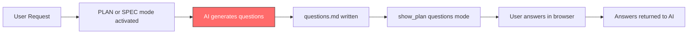

# Design: Fix Clarifying Questions Generation

## Overview

This change rewrites the question-generation instructions in two prompt sections within `extensions/lib/mode-prompts.ts`:
1. **PLAN_PROMPT** Phase 2b ("Follow-up Questions") — lines ~266-272
2. **SPEC_PROMPT** Phase 2 ("Shape Requirements") — lines ~332-342

The fix replaces vague/harmful instructions with a concrete question-writing protocol that enforces clean options, no pre-answering, no duplicates, and concise format.

No new files, no new tools, no UI changes. The `show_plan` questions mode viewer already supports the improved format — it auto-detects questions by `?` endings and `Default:` markers.

## Architecture



The red node (C) is where the fix applies. The AI's question generation behavior is controlled entirely by the prompt instructions in `mode-prompts.ts`. No other component needs changes.

## Detailed Design

### Current State (Broken)

**PLAN_PROMPT Phase 2b** (6 lines):
```
### Phase 2b: Follow-up Questions (when needed)
- If clarification is needed before planning, write questions to a markdown file
- Use numbered list format: `1. What framework should we use? _Default: React_`
- Include sensible defaults in `_Default: value_` format where possible
- Call `show_plan` in questions mode to collect answers
- The user can answer each question inline and submit
- Use the returned answers to refine your plan
```

Problems: No option format. No deduplication rule. "Include sensible defaults" is vague enough that the AI writes paragraphs justifying its assumed default.

**SPEC_PROMPT Phase 2** (problematic bullets):
```
- Generate 4-8 numbered clarifying questions with sensible defaults when needed
- Frame assumptions as "I'm assuming X, is that correct?"
- Use `_Default: value_` format for defaults
```

Problems: Literally teaches "I'm assuming X" language. "Sensible defaults" with no format guidance.

### Target State (Fixed)

Both sections will be replaced with a shared question-writing protocol. The protocol has 5 rules:

#### Rule 1: One Question = One Decision
Each question covers exactly one distinct decision. If two concerns are related, merge them into a single question. Never ask the same thing from two angles.

#### Rule 2: Lettered Options
Every question with multiple choices uses lettered options on separate lines:
```
1. How should we handle authentication?
   A) OAuth with Google/GitHub
   B) Email/password only  
   C) Both OAuth and email/password
   _Default: C_
```

#### Rule 3: No Pre-Answering
Never write "I'm assuming", "I think", "I'd recommend", "Based on my analysis", or any language that pre-selects an answer. Present all options neutrally. The `_Default:` tag is the only hint.

#### Rule 4: Concise Format
Each question is: one question line + option lines + optional `_Default: X_` line. No preamble paragraphs, no "context" sections, no codebase investigation summaries within questions.

#### Rule 5: 3-8 Questions Total
Keep the count between 3-8. If you have more, merge related decisions.

### Exact Changes

#### Change 1: PLAN_PROMPT Phase 2b

Replace the current 6-line Phase 2b with:

```
### Phase 2b: Follow-up Questions (when needed)
- If clarification is needed before planning, write questions to `.context/questions.md`
- Call `show_plan` in questions mode to collect answers:
  `show_plan { file_path: ".context/questions.md", title: "Clarifying Questions", mode: "questions" }`
- The user answers inline and submits — use their answers to refine your plan

#### Question-Writing Rules (STRICT)
1. **One question = one decision.** Never ask overlapping questions. Merge related concerns.
2. **Lettered options.** Every multi-choice question uses A) B) C) on separate lines.
3. **No pre-answering.** NEVER write "I'm assuming", "I think", "I'd recommend", or justify a choice. Present options neutrally. The `_Default:` tag is the only hint — keep it to a letter or short value.
4. **Concise.** Question line + options + optional `_Default: X_` — nothing else. No paragraphs.
5. **3-8 questions.** More than 8? Merge related decisions.

Example:
```
1. What testing scope should we target?
   A) Unit tests only
   B) Unit + integration tests
   C) Unit + integration + E2E tests
   _Default: B_

2. Which database should we use?
   A) PostgreSQL
   B) SQLite
   C) MongoDB
   _Default: A_
```
```

#### Change 2: SPEC_PROMPT Phase 2

Replace the question-related bullets in Phase 2 (Shape Requirements) with the same rules. Remove:
- `- Generate 4-8 numbered clarifying questions with sensible defaults when needed`
- `- Frame assumptions as "I'm assuming X, is that correct?"`
- `- Use \`_Default: value_\` format for defaults`

Replace with:
```
- Generate 3-8 clarifying questions following the question-writing rules below
- Write questions to `.kiro/specs/feature-name/questions.md`
- Use `show_plan` in questions mode to collect answers

#### Question-Writing Rules (STRICT)
1. **One question = one decision.** Never ask overlapping questions. Merge related concerns.
2. **Lettered options.** Every multi-choice question uses A) B) C) on separate lines.
3. **No pre-answering.** NEVER write "I'm assuming", "I think", "I'd recommend". Present options neutrally. `_Default:_` is the only hint.
4. **Concise.** Question line + options + optional `_Default: X_` — nothing else.
5. **3-8 questions total.** More than 8? Merge.
```

### What Stays the Same

- The `show_plan` tool and its questions mode UI — no changes
- The plan-viewer-html.ts question detection logic (auto-detects `?` and `Default:`)
- EARS acceptance criteria instructions in SPEC_PROMPT
- Visual assets and reusability check instructions in SPEC_PROMPT  
- All other phases in both prompts
- Commander integration sections

## Error Handling

Not applicable — this is a prompt instruction change. If the AI still generates bad questions, the user can decline and ask for revision (existing flow).

## Testing Strategy

1. **Manual verification**: After the change, trigger a SPEC or PLAN mode workflow that requires clarifying questions. Verify the output follows the new format.
2. **TypeScript compile check**: Run `tsc --noEmit` on the modified file to ensure no syntax errors in the template literal.
3. **Grep verification**: Confirm no "I'm assuming" language remains in the prompt text.
