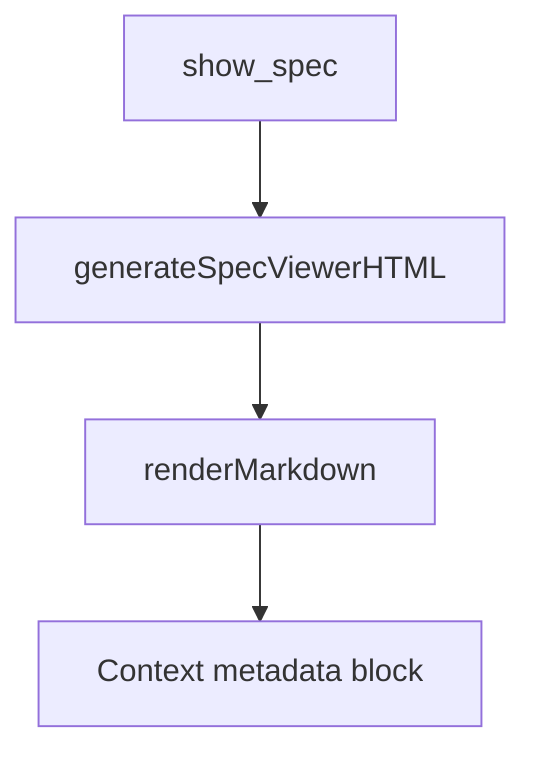

# Design

## Overview
This is a no-op smoke test design for the spec viewer.

## Architecture

## Components and Interfaces
- `show_spec` opens the viewer.
- `generateSpecViewerHTML` injects browser-side state.
- `renderMarkdown` renders markdown and Context metadata.

## Data Models
- No persistent models.
- Optional `projectContext` object is rendered when available.

## Error Handling
- The viewer must not throw when `projectContext` is absent.

## Testing Strategy
- Open this spec in the viewer.
- Verify the Context section renders successfully.
