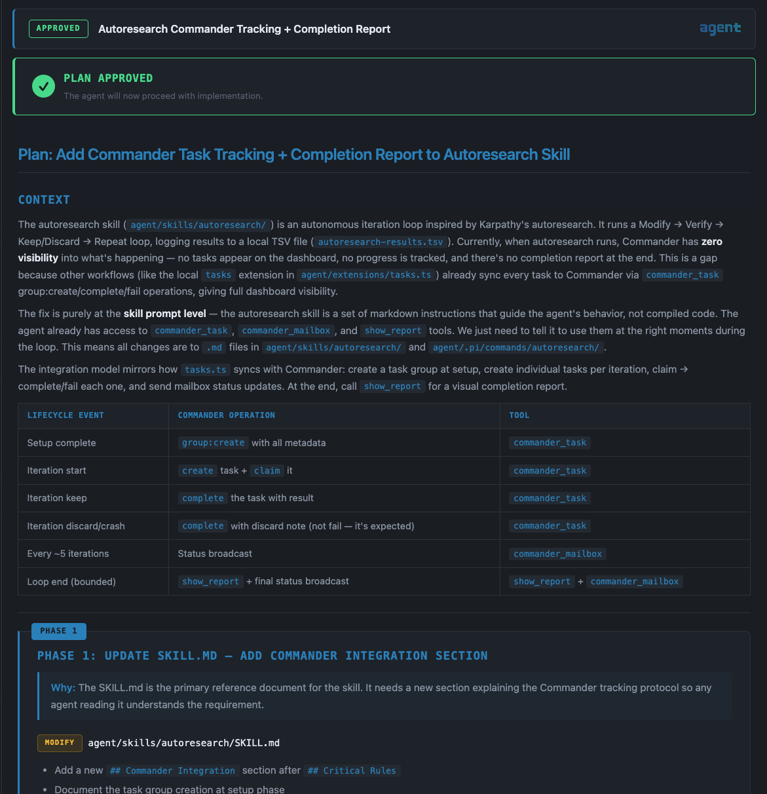
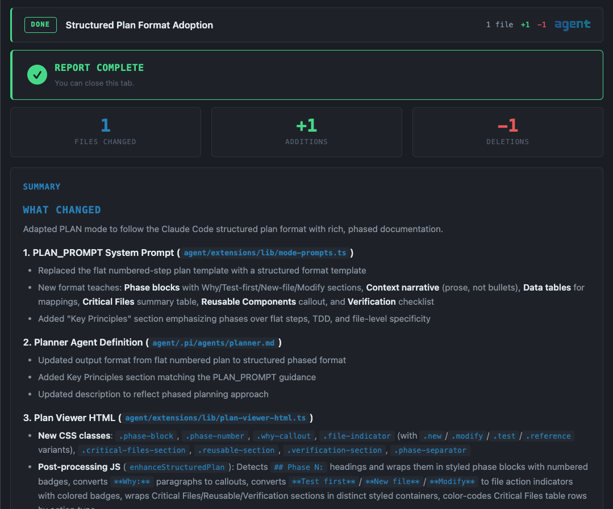

<div align="center">


<br/>

**An extension suite that turns [Pi](https://github.com/earendil-works/pi) into a multi-agent orchestration platform**

[Install](#install) · [Extensions](#extensions) · [Modes](#operational-modes) · [Orchestration](#multi-agent-orchestration)

</div>

---

## What is this?

[Pi](https://github.com/earendil-works/pi) is a terminal-based AI coding agent by Earendil Works. Out of the box it's a single-agent assistant with tool use, conversation memory, and a TUI.

**agent** is a Pi package — **60 extensions, 11 themes, and 26 skills** that transform Pi into something more:

- **7 operational modes** — NORMAL, PLAN, INVESTIGATE, SPEC, PIPELINE, TEAM, CHAIN
- **Multi-agent orchestration** — dispatch teams, run sequential chains, execute parallel pipelines, or delegate to CLI worker roles
- **Security hardened** — pre-tool-hook guard blocks destructive commands, detects prompt injection, prevents data exfiltration
- **Browser-based viewers** — interactive plan review, completion reports with rollback, spec approval with inline comments, mobile chat, and searchable reports
- **11 themes** — Catppuccin, Dracula, Nord, Synthwave, Tokyo Night, and more

Everything is configuration — no forks, no patches. Just extensions, agent definitions, and YAML.

## Install

### One-line installer (recommended)

Don't have Pi installed? No problem. The installer handles everything — installs Pi, registers the package, and configures settings in one go:

```bash
git clone https://github.com/earendil-works/pi.git && cd pi && ./install.sh
```

### Already have Pi?

```bash
pi install git:github.com/earendil-works/pi
```

Pi discovers all extensions, themes, and skills automatically.

### First Steps

1. **Type a task** — Pi operates in plan-first mode. It will ask you to define tasks before using tools.
2. **Shift+Tab** — Cycle through operational modes (NORMAL → PLAN → INVESTIGATE → SPEC → PIPELINE → TEAM → CHAIN)
3. **`/claude`** — Toggle the CLAUDE overlay for the active mode. Active modes render as `MODE + CLAUDE`, use a dark-orange banner, and route Claude-family execution paths through the Claude CLI runtime.
4. **Alt+T** — Cycle themes (`Alt+Shift+T` for reverse direction)
5. **`/agents-team`** — Switch between agent teams
6. **`/chain`** — Switch between chain workflows
7. **`/tex`** — Open Text Tools in the browser
8. **`/pi`** — Use the unified entry point for plan/investigate/spec/team/chain/pipeline workflows
9. **`/chat`** — Start the mobile-friendly web chat server for driving Pi from another device
10. **`/sounds`** — Browse and assign sounds to Pi lifecycle events

## Release notes

For detailed change history, use `git log` on this repository. The sections below describe the **current** install surface (Pi package layout, Cloud Code bridge, and orchestration features).

## Cloud Code Plugin / Skill

This repo now ships a **Claude Code plugin scaffold** and a **`pi-agent-orchestrator` skill** so Cloud Code can treat the local Pi agent suite as an orchestration backend.

### What it adds

- **Plugin manifest** — `.claude-plugin/plugin.json`
- **Local marketplace metadata** — `.claude-plugin/marketplace.json`
- **Cloud Code skill** — `skills/pi-agent-orchestrator/SKILL.md`
- **Bridge CLI** — `scripts/pi-agent-orchestrator.mjs`

### Local install in Claude Code

```bash
/plugin marketplace add .
/plugin install pi-agent-orchestrator@agent-pi-marketplace
```

### Bridge quick start

Inspect the available Pi orchestration surface:

```bash
node scripts/pi-agent-orchestrator.mjs inspect
```

Plan the orchestration mode before launching anything broad:

```bash
node scripts/pi-agent-orchestrator.mjs plan --mode auto --agent-count 1 --write-scope narrow
```

Dispatch a single Pi agent:

```bash
node scripts/pi-agent-orchestrator.mjs dispatch \
  --agent scout \
  --task "Map the current auth flow and list the key files." \
  --execute
```

Run an approved chain:

```bash
node scripts/pi-agent-orchestrator.mjs chain \
  --chain plan-build-review \
  --task "Implement the approved feature end to end." \
  --approved true \
  --execute
```

### OAuth / Auth note

The Cloud Code skill does **not** add a new OAuth flow. It reuses the existing token bridge already implemented in `extensions/oauth-provider.ts`:

- `CLAUDE_CODE_OAUTH_TOKEN`
- `PI_CLAUDE_OAUTH_TOKEN`
- fallback: `ANTHROPIC_OAUTH_TOKEN`

That keeps Cloud Code usage inside the same approved auth path already supported by this package.

## Package Structure

```
├── package.json         Pi package manifest
├── extensions/          60 TypeScript extension adapters + lib/
├── themes/              11 custom terminal themes
├── skills/              26 skill packs
├── agents/              Agent definitions + chain/pipeline/team YAML
├── commands/            Toolkit slash commands
├── prompts/             Prompt templates
└── tex/                 Text Tools — standalone text manipulation app
```

## Extensions

### Architecture boundaries

Agent-Pi is organized as a thin extension shell with testable feature modules under `extensions/lib/`. See [`docs/architecture/module-boundaries.md`](docs/architecture/module-boundaries.md) before adding new module-by-module functionality or moving business logic.

### Pacifico backend (`pacifico` extension)

The [`extensions/pacifico.ts`](extensions/pacifico.ts) extension calls your Pacifico Worker (`POST /api/infer`, job APIs) with `Authorization: Bearer …`. Use the **same** secret the Worker validates as `PACIFICO_API_KEY` (Wrangler secret in production, [`.dev.vars`](https://developers.cloudflare.com/workers/testing/local-development/#local-only-environment-variables) for `wrangler dev`). The Worker requires the secret to be **at least 32 characters** (shorter or empty disables bearer auth).

**Recommended:** run **`/pacifico-api-key`** in Pi (same TUI flow as the model picker). It stores the bearer secret in **`settings.json`** next to `pacificoModel` — the same file path Pi already uses for Pacifico model persistence, so it works even when env files and `process.env` are unavailable.

Alternatively, put `PACIFICO_API_KEY` in `process.env` or in `.pacifico.env` files (see [`extensions/.pacifico.env.example`](extensions/.pacifico.env.example)): **`<agent-pi-package-root>/.pacifico.env`** (sibling of `settings.json`), **`<cwd>/.pacifico.env`**, **`~/.config/pi/pacifico.env`**, **`~/.pacifico.env`**, **`extensions/.pacifico.env`**. You can also add a **`pacificoApiKey`** string field to `settings.json` by hand (do not commit that file if it contains secrets).

| Variable | Required | Description |
|----------|----------|-------------|
| `PACIFICO_API_KEY` | Yes for `/pacifico` and `pacifico_infer` | Bearer token; `process.env`, `.pacifico.env` files, **`pacificoApiKey` in `settings.json`**, or **`/pacifico-api-key`** |
| `HARNESS_API_KEY` | Alternate | Same bearer as Pacifico’s legacy env name; used if `PACIFICO_API_KEY` is unset |
| `PACIFICO_BASE_URL` | No | Worker origin; defaults to `https://pacifico.ruizrica2.workers.dev`; set `http://localhost:8787` when pointing at local `wrangler dev` |

Export in the environment that launches `pi` (shell profile, IDE terminal, or direnv), when you prefer not to use `.pacifico.env`:

```bash
export PACIFICO_API_KEY='your-key-matching-the-worker'
# optional for local Worker:
export PACIFICO_BASE_URL='http://localhost:8787'
```

From the Pacifico repo, upload the production secret (interactive Wrangler OAuth or `CLOUDFLARE_API_TOKEN` set): `printf '%s' "$KEY" | npx wrangler secret put PACIFICO_API_KEY`. See Pacifico `docs/hybrid-ai-harness.md`.

### Core UI

| Extension | Description |
|-----------|-------------|
| **agent-banner** | ASCII art banner on startup, auto-hides on first input |
| **footer** | Status bar — model name, context %, working directory |
| **agent-nav** | F1-F4 navigation shared across agent widgets |
| **theme-cycler** | Ctrl+X to cycle through installed themes |
| **escape-cancel** | Double-ESC cancels all running operations |
| **summary-mode** | `/toggle-summary` toggles a main-session work summary view |

### Task Management

| Extension | Description |
|-----------|-------------|
| **tasks** | Task discipline — define tasks before tools unlock; idle → inprogress → done lifecycle |
| **commander-mcp** | CLI-backed bridge exposing Commander dashboard tools as native Pi tools |
| **commander-tracker** | Reconciles local tasks with Commander; retries failed sync |

### Operational Modes

| Extension | Description |
|-----------|-------------|
| **mode-cycler** | Shift+Tab cycles NORMAL / PLAN / INVESTIGATE / SPEC / PIPELINE / TEAM / CHAIN, and `/claude` toggles a Claude CLI overlay for the active mode |
| **gemma-overlay / lmstudio-overlay** | Local model overlays for routing eligible builder-style work through LM Studio-hosted models |

Each mode injects a tailored system prompt. PLAN mode enforces plan-first workflow. INVESTIGATE mode drives structured bug/problem diagnosis with scout-led context gathering and remediation approval. SPEC mode drives spec-driven development. TEAM/CHAIN/PIPELINE modes activate their respective orchestration systems. Use `/claude` to enable a cross-mode overlay that changes the banner to dark orange, displays the active mode as `MODE + CLAUDE`, and routes Claude-family worker/advisor execution through the Claude CLI path.

### Multi-Agent Orchestration

| Extension | Description |
|-----------|-------------|
| **agent-team** | Dispatch-only orchestrator — primary agent delegates to specialists via `dispatch_agent` |
| **agent-chain** | Sequential pipeline — each step's output feeds into the next via `$INPUT` |
| **pipeline-team** | 5-phase hybrid — UNDERSTAND → GATHER → PLAN → EXECUTE → REVIEW |
| **subagent-widget** | Background subagent management with live status widgets, batch spawning, and watchdog cleanup |
| **claude-advisor** | On-demand Opus advisor tool backed by Claude Code CLI |
| **advisor-command** | Slash-command entry point for advisor-style strategy checks |
| **toolkit-commands** | Dynamic slash commands from markdown files |

### Security

| Extension | Description |
|-----------|-------------|
| **security-guard** | Pre-tool-hook: blocks dangerous commands, credential theft, and prompt injection |
| **secure** | `/secure` — full AI security sweep + protection installer for any project |
| **message-integrity-guard** | Prevents session-bricking from orphaned tool_result messages |
| **safe-port-scan / network-inspect** | Low-impact local network and port analysis tools for defensive checks |
| **security-news / security-report** | Curated advisory lookup and browser security report output |

### Viewers & Reports

| Extension | Description |
|-----------|-------------|
| **plan-viewer** | Browser GUI — plan approval with checkboxes, reordering, inline editing |
| **completion-report** | Browser GUI — work summary, unified diffs, per-file rollback |
| **spec-viewer** | Browser GUI — multi-page spec review with comments and visual gallery |
| **file-viewer** | Browser GUI — syntax-highlighted file viewer with optional editing |
| **reports-viewer** | Searchable `/reports` browser view for all persisted artifacts |
| **research-viewer** | Browser view for saved research sessions |
| **test-viewer** | Gherkin and Playwright test review surface with side-by-side editing |
| **web-chat** | Mobile-friendly chat UI with tool/subagent visibility and board actions |

<div align="center">

<br/><em>Plan Viewer — structured plan with approval controls, phase blocks, and inline code references</em>
</div>

<div align="center">

<br/><em>Completion Report — file change stats, work summary, and per-file rollback</em>
</div>

### Developer Tools

| Extension | Description |
|-----------|-------------|
| **debug-capture** | VHS-based terminal screenshots for visual TUI debugging |
| **web-test** | Cloudflare Browser Rendering — screenshots, content extraction, a11y audits |
| **tool-registry** | In-memory index of all tools with categories and search |
| **tool-search** | Meta-tool — discover and inspect tools at runtime |
| **tool-caller** | Meta-tool — invoke any tool programmatically (dynamic composition) |
| **lean-tools** | Toggle lean mode — agent uses `tool_search` + `call_tool` instead of all tools |
| **openrouter-routing** | Sync OpenRouter models, preview provider variants, and pin provider/quantization routes |
| **send-email** | AgentMail-backed report, briefing, and custom email sender |
| **sounds** | Browser sound picker for lifecycle hooks, with image cache support |

### Session & Context

| Extension | Description |
|-----------|-------------|
| **memory-cycle** | Memory-aware compaction — saves/restores context across compaction |
| **session-replay** | `/replay` — scrollable timeline of conversation history |
| **system-select** | `/system` — switch system prompt by picking agent definitions |
| **dream-scheduler** | Global-first memory consolidation and freshness tracking |
| **learn** | Delta-aware codebase snapshots into Obsidian raw/wiki memory |
| **session-recap** | Generate and persist structured session recaps |

## Operational Modes

| Mode | Trigger | Behavior |
|------|---------|----------|
| **NORMAL** | Default | Advisor-first orchestration — consult the currently selected model as the main advisor agent, prefer `grok-4.1-fast`, let the advisor choose any mix up to 16 non-advisor agents, and optionally request `red-team` / `gpt-5.4` second opinions for high-impact tasks |
| **PLAN** | Shift+Tab | Quality-first plan workflow — selected model acts as main advisor, supports up to 16 non-advisor agents, and uses cross-provider second opinions for complex/high-risk work |
| **SPEC** | Shift+Tab | Quality-first spec workflow — selected model acts as main advisor, supports up to 16 non-advisor agents, and uses cross-provider second opinions for really complex multi-step work |
| **TEAM** | Shift+Tab | Dispatcher mode — primary delegates, specialists execute |
| **CHAIN** | Shift+Tab | Sequential pipeline — step outputs chain into next step |
| **PIPELINE** | Shift+Tab | 5-phase hybrid with parallel dispatch |

### CLAUDE Overlay

Use `/claude` to toggle a provider-specific overlay on top of the current operational mode.

- Active modes display as `MODE + CLAUDE`
- The mode banner changes to dark orange
- Existing role names stay the same
- Claude-family execution paths use the Claude CLI integration while the overlay is active
- Non-Claude models continue to use their normal execution paths

### NORMAL / PLAN / SPEC — Quality-First Advisor Orchestration

NORMAL, PLAN, and SPEC now share a common **quality-first advisor → non-advisor fan-out → optional cross-provider second-opinion** strategy, while preserving their mode-specific workflows.

### NORMAL Mode — Advisor-First Orchestration

The NORMAL mode is the default operating strategy. It uses a **strategic advisor → non-advisor fan-out → optional second-opinion** pattern:

1. **Strategic Advisor** — Before substantive work, the currently selected session model acts as the main advisor agent and reviews task context, approach, scope, and complexity assessment.
2. **Preferred Worker Model** — The `grok-4.1-fast` model is the preferred worker path for fast, capable execution and content gathering. If unavailable, it gracefully falls back to `claude-haiku-4-5`.
3. **Mixed Fan-Out** — For complex, parallelizable tasks, the advisor may choose **any mix up to 16 non-advisor agents**. Workers are preferred for content gathering; builders handle execution-heavy implementation.
4. **Optional Second Opinion** — For complex, risky, or high-impact work, request a second opinion from the `red-team` reviewer (gpt-5.4). This is **not mandatory** — complexity and risk determine whether to ask.

**When to skip the advisor:**
- Simple tasks (single-file fix, quick answer, straightforward read)

**When to use the advisor:**
- Multi-step tasks with architecture or design decisions
- Risky operations (deletions, migrations, system-wide changes)
- Ambiguous requirements where approach uncertainty exists

**When to fan out agents:**
- Complex, parallelizable work with independent sub-tasks
- Features spanning multiple modules or services
- Long-running implementations that can be split
- Investigations where workers can gather context while builders implement

**When to request a second opinion:**
- Significant architectural changes
- Security or compliance work
- Ambiguous or conflicting requirements
- High-impact changes affecting many users or critical paths

### PLAN and SPEC Modes

PLAN and SPEC now use the same selected-model advisor behavior as NORMAL:
- the **currently selected session model** acts as the main advisor
- they can orchestrate **1 advisor + up to 16 non-advisor agents** when quality and complexity justify the fanout
- **workers are preferred for content gathering**, while builders handle execution-heavy slices
- second-opinion or red-team review should come from a **different provider/model family** than the main advisor
- both modes now explicitly prioritize **quality over speed**

Mode escalation remains important:
- use **PLAN** for complex tasks that need a structured plan and user approval before coding
- use **SPEC** for really complex multi-step work that needs requirements, design, task breakdown, and approval before implementation

## Multi-Agent Orchestration

### Teams

Teams are defined in `agents/teams.yaml`. Each team is a list of agent names. Agent definitions live in `agents/*.md` with YAML frontmatter.

```yaml
plan-build:
  - planner
  - builder
  - reviewer
```

### Claude CLI Roles

Pi can now integrate Claude Code CLI in two distinct ways:

- **`claude-worker`** — an execution-oriented Claude subagent that behaves like a normal worker with live widget updates and a compact rolling console preview.
- **`claude-advisor`** — an Opus-backed advisor that reviews shared task context on demand and returns recommendations, risks, alternatives, and next actions.

Claude-family routing is **CLI-only**:

- `claude-worker` and `claude-advisor` execute through the local `claude` subprocess.
- Generic workers/advisors whose resolved model is `anthropic/claude-*` are routed through the same Claude CLI path instead of `pi --model anthropic/claude-*`.
- The top-level Anthropic provider is overridden with a Claude CLI-backed stream handler so main-session Claude turns do not silently use the direct Anthropic SDK/API path.
- If a Claude-family request cannot be sent through the CLI path, it fails closed instead of falling back to direct SDK/API.

This follows an **executor + advisor** pattern:

- the main Pi executor can use the CLI-backed Anthropic provider for Claude-family model turns,
- `claude-worker` can be dispatched like any other worker,
- `claude-advisor` is called only when high-value advice is needed,
- all Claude CLI paths receive a shared context packet built from the working directory, active plan, task, and file hints.

Example usage:

```text
dispatch_agent { agent: "claude-worker", task: "Implement the approved refactor plan" }
claude_advisor { question: "Should we split this into worker and advisor runtimes?", files: ["extensions/lib/toolkit-cli.ts", "extensions/subagent-widget.ts"] }
```

### Toolkit Worker Roles

Pi also exposes execution-oriented worker wrappers for installed third-party coding CLIs:

- **`cursor-worker`** — wraps Cursor Agent headless mode
- **`codex-worker`** — wraps `codex exec`
- **`droid-worker`** — wraps `droid exec`
- **`gemini-worker`** — wraps Gemini CLI headless prompt mode
- **`opencode-worker`** — wraps `opencode run`
- **Local LM Studio overlays** — route eligible builder-style roles to local Gemma/Qwen models when configured

These workers follow the same task-oriented pattern as `claude-worker`: they receive the Pi task prompt, run non-interactively in the current workspace, and stream their CLI output back into the Pi widget/follow-up flow.

Legacy names such as `cursor-agent`, `codex-agent`, `droid-agent`, `gemini-agent`, and `opencode-agent` remain supported as compatibility aliases, but new usage should prefer the `*-worker` names.

Example usage:

```text
dispatch_agent { agent: "codex-worker", task: "Implement the approved refactor plan" }
dispatch_agent { agent: "opencode-worker", task: "Summarize the repo structure and propose the next edits" }
```

### Chains

Chains are sequential pipelines defined in `agents/agent-chain.yaml`. Each step specifies an agent and a prompt template with `$INPUT` (previous output) and `$ORIGINAL` (user's original prompt).

```yaml
plan-build-review:
  description: "Plan, implement, and review"
  steps:
    - agent: planner
      prompt: "Plan the implementation for: $INPUT"
    - agent: builder
      prompt: "Implement the following plan:\n\n$INPUT"
    - agent: reviewer
      prompt: "Review this implementation:\n\n$INPUT"
```

### Pipelines

Pipelines are defined in `agents/pipeline-team.yaml` and combine sequential phases with parallel agent dispatch.

## Security

The security system operates at three layers:

1. **`tool_call` hook** — Pre-execution gate blocks dangerous commands before they run
2. **`context` hook** — Content scanner strips prompt injections from tool results
3. **`before_agent_start` hook** — System prompt hardening reminds the agent of security rules

The `/secure` command runs a comprehensive AI security sweep on any project and can install portable protections.

## Migration notes

### SDK namespace rename: `@mariozechner/pi-*` → `@earendil-works/pi-*`

The upstream Pi SDK moved scopes from `@mariozechner` to `@earendil-works`. This package's `peerDependencies` now point at the new `@earendil-works/pi-agent-core`, `@earendil-works/pi-coding-agent`, and `@earendil-works/pi-tui` packages, and all extension imports have been updated to match.

If you're upgrading from an earlier checkout, after pulling:

```bash
yarn install
```

This refreshes the lockfile and pulls the new scoped packages. No source changes are needed in your own extensions unless you authored imports against the old `@mariozechner` scope — in that case, do a project-wide find/replace from `@mariozechner/pi-` to `@earendil-works/pi-`.

The installer (`./install.sh`) and the `pi install git:github.com/earendil-works/pi` flow already use the new scope, so fresh installs need no extra step.

### Theme-cycle hotkey: Ctrl+X → Alt+T

The theme-cycle shortcut moved from `Ctrl+X` (which collides with terminal "cut" and the Emacs prefix) and `Ctrl+Q` (which collides with XON/XOFF flow control in some terminals) to:

- **`Alt+T`** — Cycle theme forward
- **`Alt+Shift+T`** — Cycle theme backward

The `/theme` command still works for direct picking. If you had a muscle-memory binding to `Ctrl+X`, the new key keeps the same mnemonic ("T" for Theme) and avoids the terminal conflicts.

